# **Exploration of Economic Trends in South Asia Across Major Crises**

Authors: Christina Dai (2585695), Kenneth He (2724494), Tina Piltner (2615282), Joe Xia (2608991), Eric Wang (2608963)

## Introduction

*This project examines how major global crises affected economic conditions across South Asia by comparing trends in employment ratio, GDP growth, and GDP per capita for Bangladesh, Bhutan, India, Sri Lanka, Maldives, Nepal, and Pakistan. The analysis compares regional patterns surrounding the 1997 Asian Financial Crisis, the 2008 global financial crisis, and the COVID-19 pandemic in order to evaluate how different types of shocks affected economic performance and recovery across selected South Asian countries.*

Description of topic and main findings

Summary of main findings

## Data Description

All data in this project comes from the World Bank's World Development Index database. For the purpose of this project, we focused on seven countries in South Asia to analyze their economic trends. Raw data for economic indicators of interest were pulled from the World Bank API using their specific indicator codes and stored in a local SQLite database. We ran a custom SQL cleaning script to rename columns for readability, mapped ISO country codes to full country names, rounded all numeric values to two decimal places, and filtered out rows where all key indicators were missing. A flag column was also added to identify the years of the major economic shocks we were interested in. The economic indicators we pulled were gdp_per_capita, gdp_growth_pct, and employment_ratio. GDP_per_capita is a measure of average economic output per person, adjusted for inflation by rescaling to 2015 USD. GDP_growth_pct is annual percentage growth of GDP which can be interpreted as a measure of the rate of economic growth. The employment_ratio indicator is a ratio of the employed to the total country working age population.

## Data Analysis

*Interpretation of main results and trends*

*Well-formatted tables and plots*

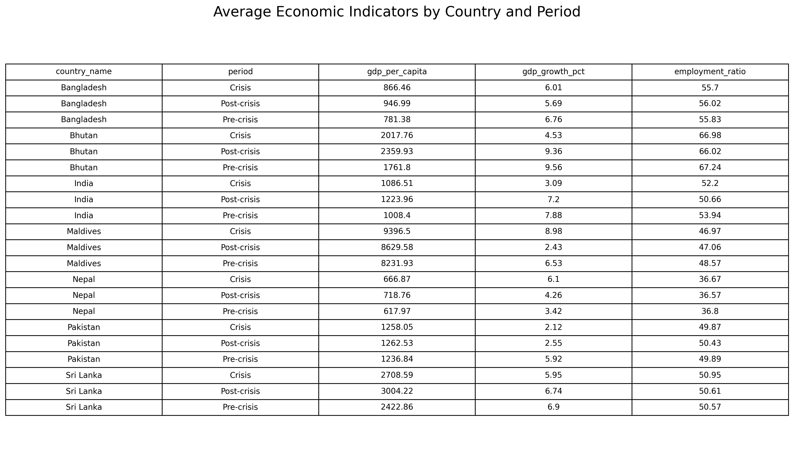{#table-average fig-align="center"}

### 1997 Asian Financial Crisis:

The 1997 Asian Financial Crisis was a financial collapse that began in Thailand when its currency lost value, quickly spreading to other Asian economies like Indonesia, South Korea, and Malaysia. It caused sharp declines in currencies, stock markets, and economic growth, leading to widespread business failures and significant economic hardship across the region.

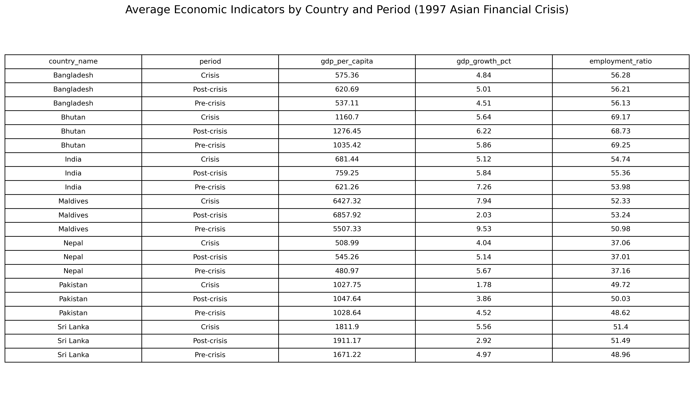{#fig-country_period_avg_table_1997 fig-align="center"}

@fig-country_period_avg_table_1997 summarizes the average GDP per capita, GDP growth rate, and employment ratio for each country during pre-crisis, crisis, and post-crisis periods, visualizing which countries diverged most from the general trend in South Asia. The table shows that the average GDP growth dipped slightly during the crisis period but still remained positive for every country. GDP per capital increased consistently. Employment ratios show almost no variation. The statistics shows that the 1997 Asian Financial Crisis had overall little impact on South Asia.

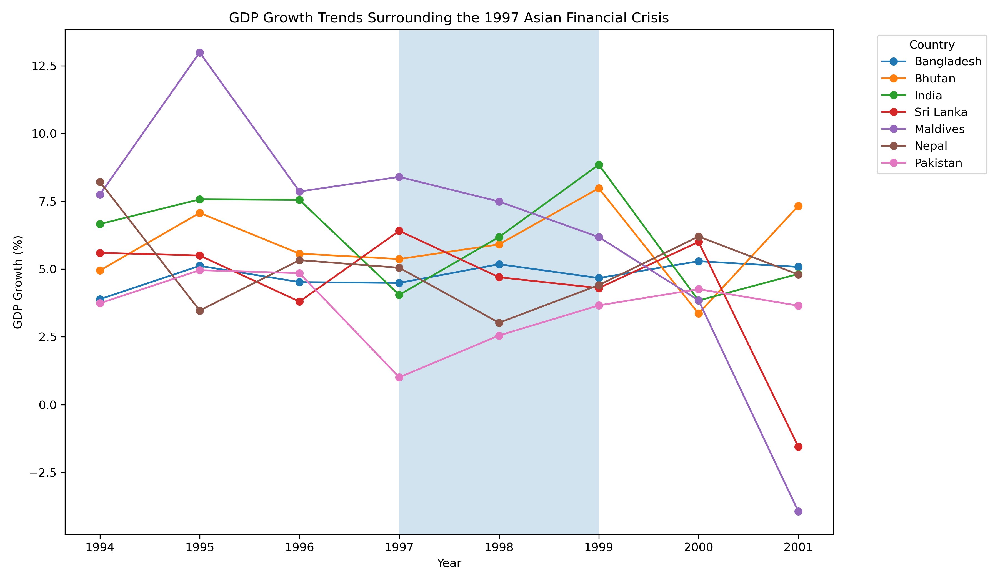{#fig-gdp_growth_1997crisis fig-align="center"}

@fig-gdp_growth_1997crisis tracks annual GDP growth rates from 1994–2001, with the crisis years (1997–1998) shaded. It shows that most South Asian countries saw only a mild dip in growth. The overall pattern indicates that the indident acted more as a headwind rather than an extremely destructive financial crisis for South Asia.

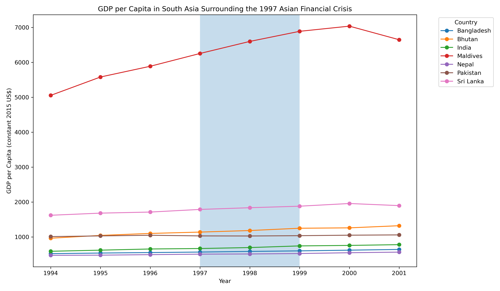{#fig-gdp_per_capita_1997crisis fig-align="center"}

@fig-gdp_per_capita_1997crisis shows GDP per capita trajectories. Every country's GDP per capita continued rising through 1997–1998, which shows South Asia's insulation from the 1997 Asian Financial Crisis. This chart provides the strongest evidence of South Asia's resilience to the 1997 Asian Financial Crisis.

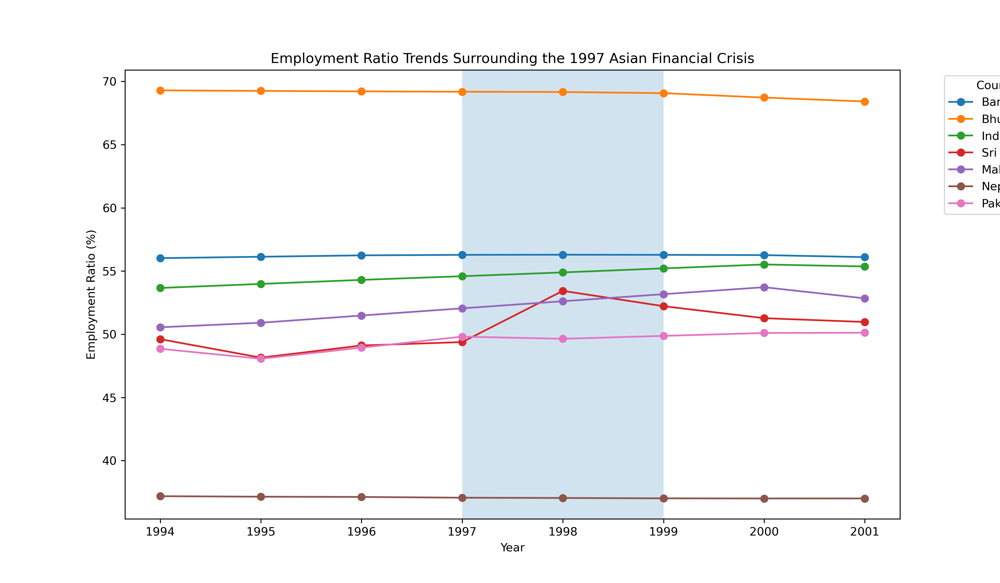{#fig-employment_ratio_1997crisis fig-align="center"}

@fig-employment_ratio_1997crisis shows employment-to-population ratios over time. The near-flat lines across all countries indicate that the crisis had no measurable impact on labor markets in the region.

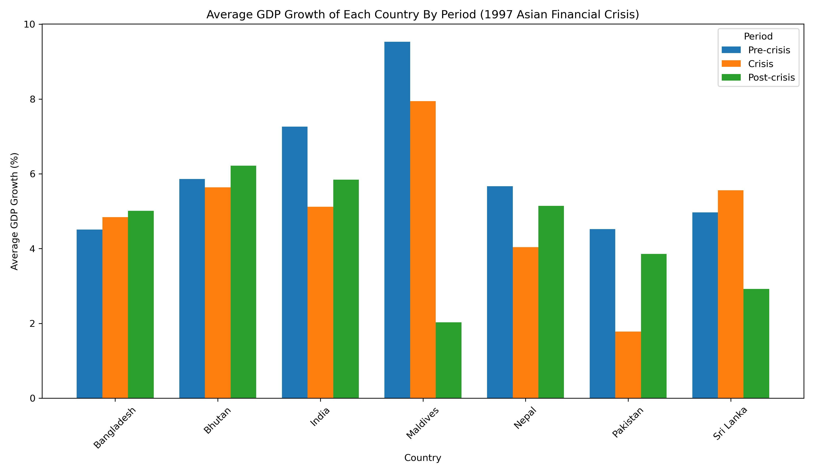{#fig-gdp_bar_1997crisis fig-align="center"}

@fig-gdp_bar_1997crisis compares average GDP growth across pre-crisis, crisis, and post-crisis periods for each country. The crisis had very little impact on Bangladesh, Bhutan, Sri Lanka, and Nepal. Pakistan and India, on the other hand, experienced moderate impact by the 1997 Asian Financial Crisis. Maldives didn't experience negative impact, but saw high growth throughout.

### 2008 Global Financial Crisis:

The 2008 Global Financial Crisis was a severe worldwide economic downturn triggered by the collapse of the U.S. housing market and the failure of major financial institutions. It led to widespread bank failures, massive job losses, and a deep global recession that affected economies around the world.

The 2008 global financial crisis affected South Asian economies differently across employment, output growth, and income levels. The following figures summarize trends in employment ratio, GDP growth, GDP per capita, and average crisis-period comparisons across the selected countries.

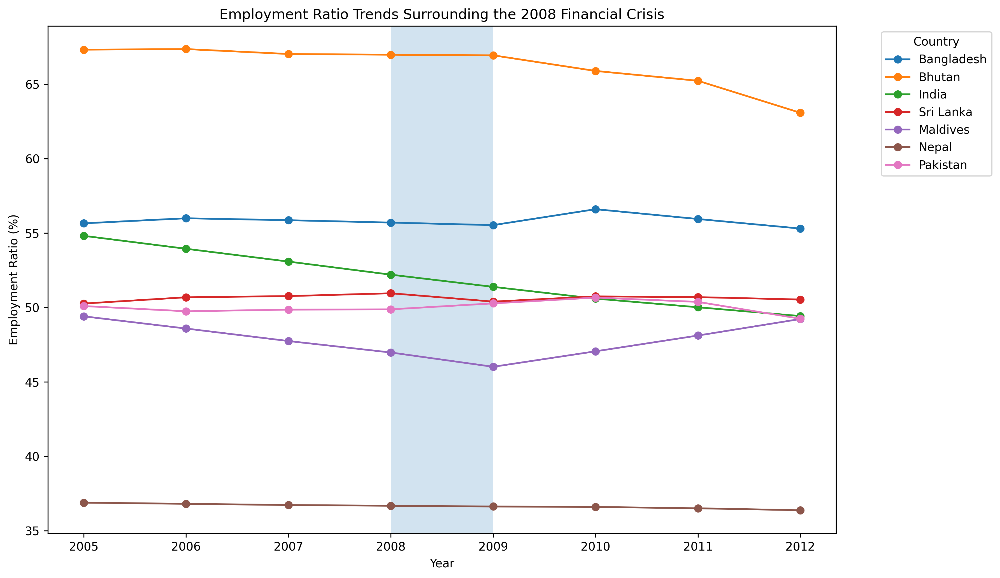{#fig-employment-2008 fig-align="center" width="90%"}

@fig-employment-2008 shows employment ratio percentages for seven South Asian countries from 2005 to 2012, with a shaded region to mark the 2008–2009 financial crisis. Based on the figure, employment ratios were relatively stable across most South Asian countries during the 2008 crisis period. Bhutan remained the highest throughout despite a later decline, India and Maldives experienced more noticeable drops around and after the crisis period, while Bangladesh, Sri Lanka, Pakistan, and Nepal stayed comparatively steady with only modest fluctuations.

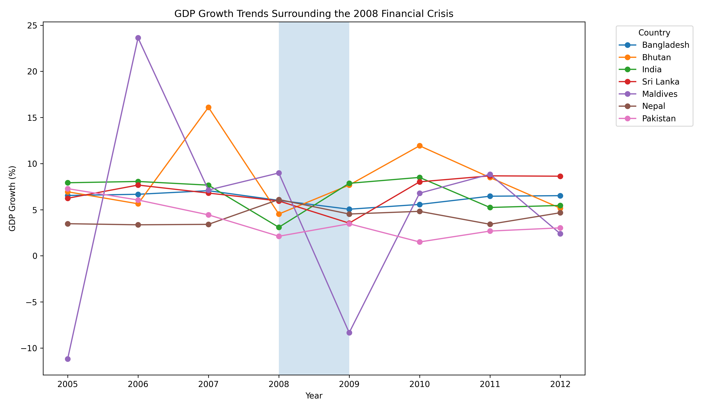{#fig-gdpgrowth-2008 fig-align="center" width="90%"}

@fig-gdpgrowth-2008 tracks the annual GDP growth percentages for South Asian countries from 2005 to 2012, using a shaded region to highlight the economic impact of the 2008–2009 financial crisis. The data shows that while most of these nations maintained positive growth despite a general slowdown during the crisis window, the Maldives exhibited extreme volatility and dropped sharply into negative growth in 2009.

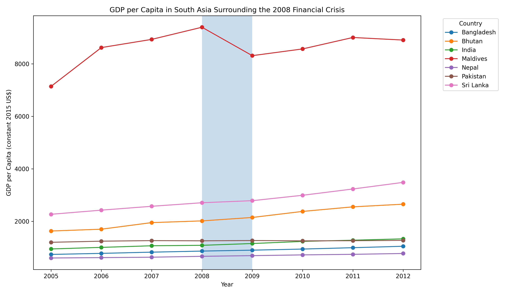{#fig-gdppc-2008 fig-align="center" width="90%"}

@fig-gdppc-2008 illustrates the GDP per capita for South Asian nations from 2005 to 2012. The Maldives had significantly higher GDP per capita than the other countries and suffered a distinct decline during the 2008 financial crisis. However, the other economies remained relatively steady.

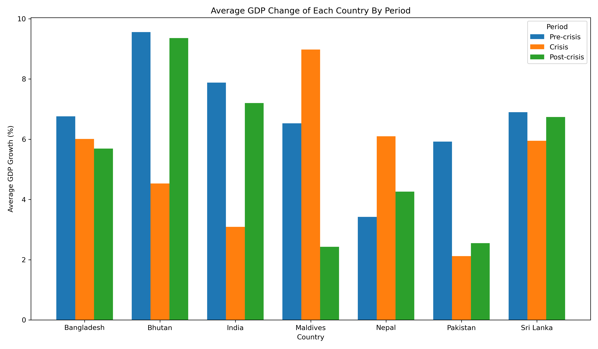{#fig-gdpbar-2008 fig-align="center" width="85%"}

@fig-gdpbar-2008 compares average GDP growth before, during, and after the 2008 crisis. The crisis affected South Asian countries unevenly. Bhutan, India, Pakistan, and Sri Lanka experienced lower average growth during the crisis than in the pre-crisis period, while Maldives and Nepal show higher crisis-period averages, indicating variation in economic resilience and recovery.

#### COVID-19 Pandemic:

The COVID-19 pandemic caused a sharp global economic downturn as lock-downs halted business activity, disrupted supply chains, and triggered one of the fastest stock market crashes in history. It led to widespread job losses, reduced consumer spending, and severe declines in industries like travel and hospitality, creating lasting instability across global markets.

The COVID-19 pandemic affected South Asian economies unevenly across employment, output growth, and income levels. The following figures summarize trends in employment ratio, GDP growth, GDP per capita, and average pandemic-period comparisons across the selected countries.

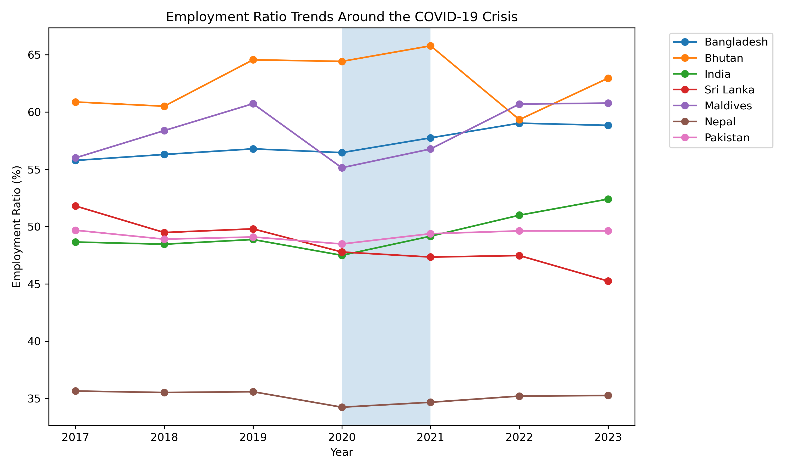{#fig-employment-covid fig-align="center" width="90%"}

@fig-employment-covid shows employment ratio percentages for seven South Asian countries from 2017 to 2023, with a shaded region marking the core pandemic years of 2020–2021. Based on the figure, employment ratios remained relatively stable across most countries despite short-term disruptions. Bhutan maintained one of the highest employment ratios, though it declined sharply in 2022 before recovering. Bangladesh and India experienced moderate increases after the pandemic, while Maldives showed a temporary drop in 2020 followed by a strong rebound. Nepal remained the lowest throughout with only minor variation.

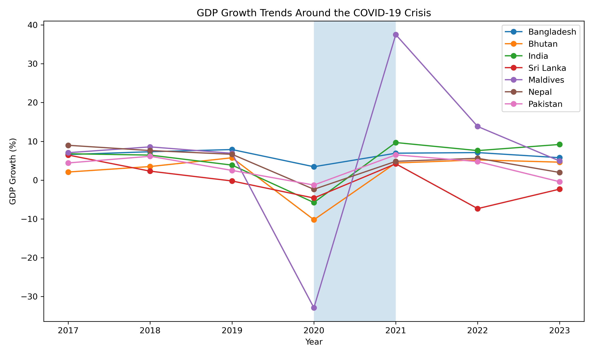{#fig-gdpgrowth-covid fig-align="center" width="90%"}

@fig-gdpgrowth-covid tracks annual GDP growth percentages for South Asian countries from 2017 to 2023, using a shaded region to highlight the pandemic shock in 2020–2021. The figure shows that most countries experienced a sharp slowdown or contraction in 2020, followed by recovery in 2021. Maldives exhibited the most extreme volatility, collapsing deeply in 2020 before rebounding strongly in 2021. India also recorded a notable contraction in 2020 and rapid recovery afterward, while Bangladesh remained comparatively resilient with consistently positive growth.

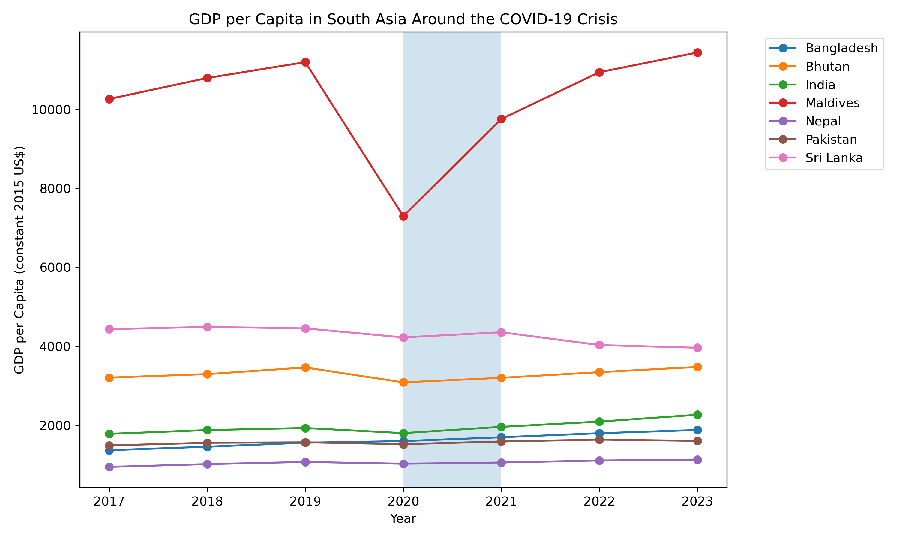{#fig-gdppc-covid fig-align="center" width="90%"}

@fig-gdppc-covid illustrates GDP per capita for South Asian nations from 2017 to 2023. Maldives had significantly higher GDP per capita than the other countries but suffered a pronounced decline in 2020 during the pandemic before recovering in subsequent years. Most other countries experienced only modest interruptions and resumed gradual upward trends after 2020, particularly Bangladesh and India.

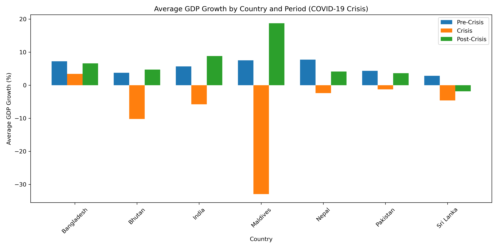{#fig-gdpbar-covid fig-align="center" width="85%"}

@fig-gdpbar-covid compares average GDP growth before, during, and after the pandemic. The pandemic affected South Asian countries unevenly. Bangladesh maintained positive average growth throughout all periods, indicating strong resilience. Maldives and Bhutan experienced severe contractions during the crisis period but posted strong recoveries afterward. India and Nepal also rebounded notably post-pandemic, while Sri Lanka remained comparatively weak in the recovery phase.

## Results and Discussion

Clarity, conciseness, and relevance of discussion

Reflection on findings and any limitations

**1997 Asian Financial Crisis.** The most striking finding in the 1997 Asian Financial Crisis is how insulated South Asia was from the crisis that devastated much of East and Southeast Asian Countries. Despite the crisis, GDP per capita of all the South Asian countries continued to rise throughout 1997 – 1998 without exception, and average regional GDP growth only fell by less than 1% from 6.0% pre-crisis to 5.1% during the crisis.
The resilience can be explained by limited financial integration between South Asian countries and East & Southeast Asia. South Asian economies had restricted capital accounts and underdeveloped equity market. Usually, these characteristics would be considered a reflection of bad economic and financial system development. However, during the 1997 Asian Financial Crisis, the characteristics shielded the South Asian countries from currency speculation and capital flight that triggered crisis instead.
That said, South Asia wasn’t completely unaffected by the crisis. Some countries, especially Pakistan and India, experienced significant economic slowdown. Pakistan’s average GDP growth dropped from 4.5% pre-crisis to just 1.8% during the crisis period. India also saw a dip to 4.1% growth rate in 1997 before rebounding to 6.2% in 1998 and fully recovered to 8.9% in 1999. Employment ratios remained largely flat throughout the period across all countries, which suggests that the pressure on economic growth did not translate into labor market disruption. Nepal and Bangladesh showed the least volatility of any country across all three metrics.

## Conclusion